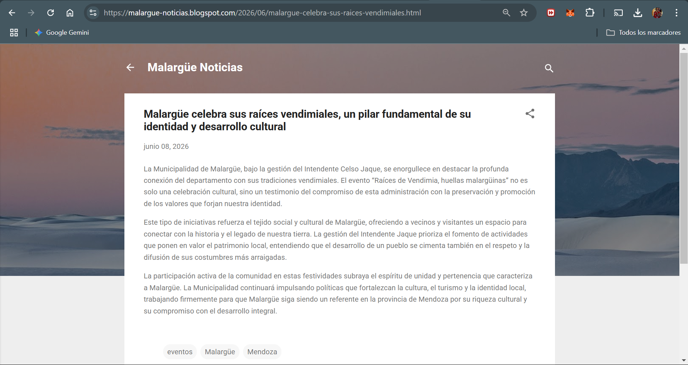

# 🏛️ Motor Automatizado de Prensa Política (RRPP con IA)

Un pipeline de automatización end-to-end diseñado para el monitoreo, curaduría y generación de comunicados de prensa en el sector gubernamental y político. 

A diferencia de un bot de redacción tradicional, este sistema actúa como un **Secretario de Prensa Autónomo**. Combina extracción de datos en tiempo real (ETL), procesamiento avanzado con Modelos de Lenguaje Grande (LLMs) fuertemente condicionados por contexto político, y un sistema de validación estricta para garantizar la seguridad de la imagen institucional (Brand Safety).

---

## 🏗️ Evolución de la Arquitectura: De n8n a Python Puro (Agentic Workflow)

Originalmente prototipado en n8n para iteración rápida (Low-Code), el sistema migró a un **Backend en Python Puro** para superar las limitaciones de la orquestación visual y lograr un control absoluto sobre el flujo de ejecución, el asincronismo y la persistencia de datos.

La arquitectura actual implementa un **Flujo Agéntico de 3 Etapas** utilizando procesamiento concurrente:

1. **Ingesta Asíncrona (ETL):** Un motor basado en `asyncio` que consume feeds RSS. Implementa algoritmos de deduplicación utilizando hashes criptográficos y una base de datos local SQLite para evitar procesar noticias repetidas.
2. **Sistema Agéntico Multicapa:** En lugar de un solo prompt masivo, la información fluye por tres agentes especializados:
   - **`PoliticalFramer`:** Analiza la noticia cruda y le aplica el "encuadre" político correcto según las directrices del cliente.
   - **`ArticleWriter`:** Toma el contexto del Framer y redacta el comunicado con formato periodístico.
   - **`QualityGate`:** Un agente evaluador estricto que veta la publicación si detecta desviaciones del manual de estilo o riesgos de *Brand Safety*.
3. **Gestión de Estados (SQLite):** Se abandonó Google Sheets en favor de una base de datos transaccional SQLite local, garantizando integridad referencial y baja latencia. Cada artículo nace como `PENDING`.
4. **Sistema de Aprobación (HITL con Telegram):** Un bot de Telegram integrado asíncronamente recibe los artículos aprobados por el *QualityGate*. El administrador humano tiene la decisión final mediante botones interactivos (Callbacks).
   

5. **Distribución Omnicanal:** Al recibir el `APROBADO`, el sistema despacha el contenido automáticamente a través de la API de Blogger (con capacidad de escalado a otras redes).
   

---

## 🛡️ Brand Safety y Quality Gate

En un entorno gubernamental, un error de comunicación desencadena crisis institucionales. Para asegurar la estabilidad en producción, el sistema cuenta con:

### Ingeniería de Prompts Modular
El ecosistema político local (ej. a quién defender, qué conflictos neutralizar) se inyecta dinámicamente en el `PoliticalFramer`. 

### Tolerancia a Fallos y Verificación Cruzada
Si los LLMs (usualmente Gemini vía LangChain/API directa) alucinan o entregan formatos incorrectos, el `QualityGate` actúa como cortafuegos. El sistema no hace *crash*; simplemente veta la noticia y la marca como bloqueada en la base de datos local, alertando sobre el motivo.

---

## 🚀 Liberty Press Framework: Características Técnicas

El núcleo del sistema fue diseñado pensando en la escalabilidad y en resolver problemas reales de publicación automatizada:

### 1. Optimizaciones SEO Automatizadas (Blogger API)
En lugar de simplemente hacer POST del contenido, la integración con Blogger (en `blogger_publisher.py`) inyecta dinámicamente etiquetas (labels) hiper-locales y utiliza el campo `customMetaData` para asegurar que cada artículo generado tenga una **Meta Descripción** optimizada para motores de búsqueda, aumentando la visibilidad orgánica.

### 2. Prevención de Duplicados (Hashing & SQLite)
Para evitar que el motor publique la misma noticia cubierta por diferentes medios, el ETL asíncrono genera un hash criptográfico del contenido (`content_hash`). Las colisiones se validan instantáneamente contra una base de datos local SQLite, garantizando que el bot solo procese información verdaderamente nueva.

### 3. Arquitectura Multi-Tenant Segura
El directorio `clientes/` permite manejar distintos municipios o candidatos desde la misma instancia. Los archivos `config.json` inyectan el tono, las directrices y las fuentes RSS específicas en tiempo de ejecución, manteniendo la lógica del código fuente 100% agnóstica al contexto político.

### 4. Pipeline Asíncrono (Asyncio)
Para manejar la alta latencia de las llamadas a LLMs y la publicación web, el flujo principal (`main.py`) delega la ingesta, el encolado de mensajes de Telegram y las peticiones a Blogger en `asyncio.Queue` y Executores, evitando cuellos de botella y bloqueos en el hilo principal.
